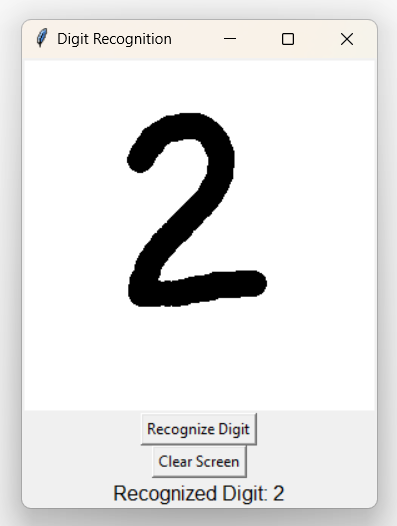
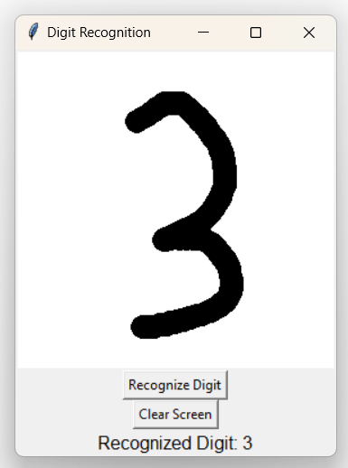
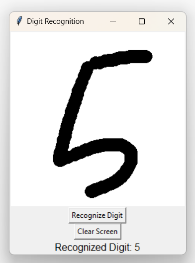
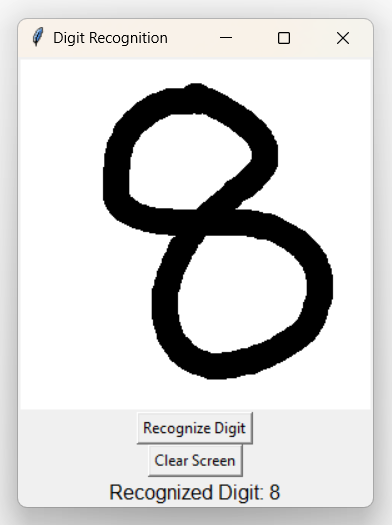

# Handwritten Digit Recognition

This is a GUI-based handwritten digit recognition project built using a Convolutional Neural Network (CNN).
Users can draw a digit (0–9) on a canvas, and the trained model predicts the digit in real time.

The model is trained on the MNIST dataset and achieves 99.51% accuracy on the test set.


Dataset:
--------

MNIST Dataset: Available for download from
https://www.kaggle.com/datasets/hojjatk/mnist-dataset

or 

Load dataset directly from keras dataset:
```
from keras.datasets import mnist
(x_train, y_train), (x_test, y_test) = mnist.load_data()
```

Software Resources:
-------------------

Python Version: 3.6 or later (https://www.python.org/downloads/) <br/>
TensorFlow: Deep learning framework for model construction and training
(https://www.tensorflow.org/) <br/>
Keras: High-level API for building and training neural networks
(https://keras.io/) <br/>
NumPy Library: for numerical computations and array manipulation
(https://numpy.org/) <br/>
Matplotlib Library: for data visualization (https://matplotlib.org/)
TKinter Standard Python library: for creating graphical user interfaces

Output:
-------



<br/>


