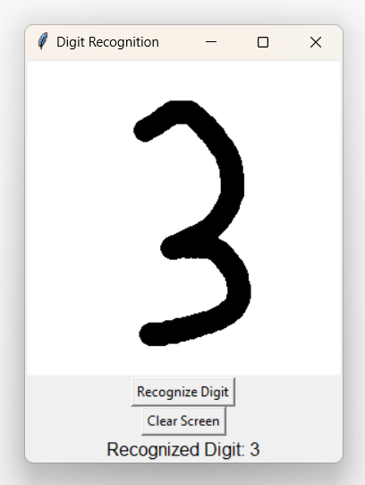

# Handwritten Digit Recognition

This project triumphantly tackles the challenge of recognizing handwritten digits
with remarkable accuracy, harnessing the power of Convolutional Neural
Networks (CNNs). The project deftly employs the MNIST dataset, a renowned
benchmark in the realm of image classification, to meticulously train and evaluate
its model. Through a judicious blend of data augmentation, hyperparameter
tuning, and regularization techniques, the project achieves a commendable
accuracy of 99.51% on the MNIST test set, showcasing its effectiveness in
deciphering handwritten numerical characters. 


Dataset:
--------

MNIST Dataset: Available for download from
https://www.kaggle.com/datasets/hojjatk/mnist-dataset

or 

Load dataset directly from keras dataset:
```
from keras.datasets import mnist
(x_train, y_train), (x_test, y_test) = mnist.load_data()
```

Software Resources:
-------------------

Python Version: 3.6 or later (https://www.python.org/downloads/) <br/>
TensorFlow: Deep learning framework for model construction and training
(https://www.tensorflow.org/) <br/>
Keras: High-level API for building and training neural networks
(https://keras.io/) <br/>
NumPy Library: for numerical computations and array manipulation
(https://numpy.org/) <br/>
Matplotlib Library: for data visualization (https://matplotlib.org/)
TKinter Standard Python library: for creating graphical user interfaces

Output:
-------



<br/>

